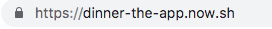
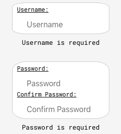
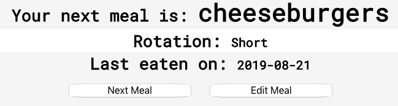

# Dinner. The App.

## To see the app in action, you can visit: [Dinner-the-app](https://dinner-the-app.now.sh)

### API Documentation

GET /meals  
Request body params: none  
Success response object: {  
 status: 200,  
 meals: [Array of meal objects]  
}  
Failed response object: {  
 status: 400,  
 message: "String"  
}

POST /meals  
Request body params: {  
 meal: "String",  
 rotation: "String"  
}  
Success response object: {  
 status: 201,  
 meal: [Array of meal object]  
}  
Failed response object: {  
 status: 400,  
 message: "String"  
}

PATCH /edit-meal/:mealid  
Request body params: {  
 meal: "String",  
 rotation: "String",  
 mealid: "String"  
}  
Success response object: {  
 status: 201,  
 meal: [Array of meal object]  
}  
Failed response object: {  
 status: 400,  
 message: "String"  
}

DELETE /edit-meal/:mealid  
Request body params: {  
 mealid: "String"  
}  
Success response object: {  
 status: 200,  
 mealid: "String"  
}  
Failed response object: {  
 status: 400,  
 message: "String"  
}

### Screenshots

Start by navigating to the site:  
  
Create a new user by clicking on the "I need to Sign Up" button and filling in the form:  
  
Add at least one meal to each rotation list and you will be able to view your current meal:  
  
When you click "Next Meal" that meal will be sent to the back of the line. The next time it comes up in your rotation, today's date will be displayed as the 'Last eaten on:' date.

### Summary

If you cook a lot of different things then this app keeps you from forgetting any yummy meals you enjoy. Just add meal names into the database and the app's algorithm provides you with the next meal you should eat. The meals are divided into three 'rotations'; short, medium, and long. The pattern that the app uses to pull meals from each list is S -> M -> S -> M -> S -> L. The app works best if you have a similar number of meals in each rotation. When you view the current meal, the date it was last eaten on is displayed as well. Meal names and rotation lists can be edited easily, and the full list of meals can be viewed.

### Tech used

Frontend: Javascript, CSS, React.js  
Backend: Node.js, Express, PostgreSQL
